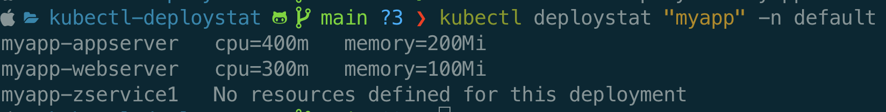

# Golang - CLI Application to view Kubernetes Deployment Stats

- Golang CLI Application to get CPU, memory stats related to deployment using Cobra package.
- Takes deployment name as a substring input and lists all deployments with the matching string.
- Namespace(-n) as a flag input.
- This is a kubectl plugin, So can be integrated with kubectl.
- If the deployment doesn't have resources values set it will show the custom message. 


## Prerequesites Tools
- Minikube
- Docker


## Inputs
- Deployment name to search for. 
- Namespace to search in as a flag.

## How to use
1. Start minikube.
    ```
    minikube start
    ```
2. Run a few deployments and set cpu/memory requests for them.
    ```
    Kubectl create deployment myapp-webserver --image=nginx --replicas=3
    ```
3. Go build from the root directory to generate the executable.
    ```
    go build
    ```
4. Add executable dir to the PATH var
    ```
    export PATH=$PWD/:$PATH
    ```
5. Run using kubectl, where "myapp" is the input parameter for the deployment you are searching for. default is the input namespace.
    ```
    kubectl deploystat myapp -n default
    ```


